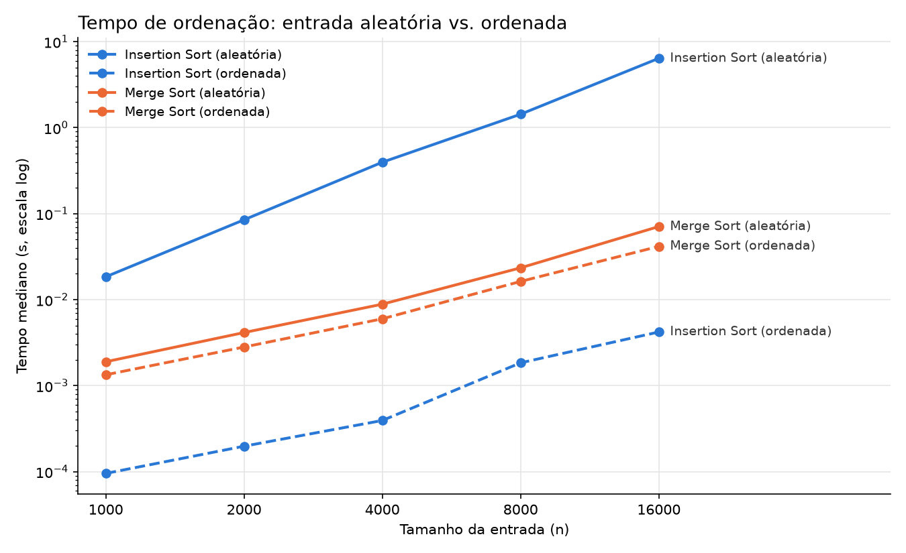

# Medindo o Efeito da Entrada no Desempenho

## 1. Objetivo

Este trabalho tem como objetivo comparar o desempenho de dois algoritmos
de ordenação: Insertion Sort e Merge Sort.

Os algoritmos serão testados utilizando dois tipos de entrada:
- listas aleatórias;
- listas já ordenadas.

A comparação busca observar como a organização dos dados de entrada
influencia o tempo de execução de cada algoritmo.

---

## 2. Algoritmos utilizados

### 2.1 Insertion Sort

O Insertion Sort é um algoritmo de ordenação que percorre a lista
gradualmente, inserindo cada elemento na posição correta em relação
aos elementos que já foram percorridos.

No código, o elemento atual é armazenado na variável `chave`.
Em seguida, os elementos maiores que essa chave são deslocados
uma posição para a direita até que seja encontrada a posição correta.

O algoritmo apresenta comportamento diferente dependendo da organização
da lista. Em uma lista já ordenada, poucos deslocamentos são necessários,
enquanto em uma lista aleatória podem ocorrer muitos deslocamentos.

---

### 2.2 Merge Sort

No Merge Sort, primeiramente, a lista é dividida em duas partes. Esse processo continua
recursivamente até que as partes tenham apenas um elemento. Depois,
as partes são combinadas novamente em ordem.

No código, a função `meSort` realiza a divisão da lista, enquanto
a função `juntar` combina as duas partes já ordenadas.

Diferentemente do Insertion Sort, o Merge Sort mantém um comportamento
mais estável independentemente de a entrada estar aleatória ou ordenada.

---

## 3. Geração das entradas

O arquivo `ListaRand.py` é responsável por gerar os dados utilizados
nos testes.

A função `listaRand()` gera uma lista com valores aleatórios.

Uma semente fixa (`seed = 42`) foi utilizada para que os testes possam
ser reproduzidos com os mesmos valores.

A função `listaOrd()` recebe uma lista aleatória e cria uma versão
ordenada dela. Dessa forma, a comparação entre os cenários utiliza
os mesmos valores, modificando apenas a ordem dos elementos.

---

## 4. Metodologia de medição

As medições são feitas pelo arquivo `medir.py`, que segue o protocolo:

- 5 tamanhos de entrada, dobrando a cada passo: 1.000, 2.000, 4.000, 8.000 e 16.000;
- para cada tamanho, uma única lista aleatória é gerada e usada pelos dois
  algoritmos, garantindo uma comparação justa;
- cada combinação (algoritmo + cenário + tamanho) é executada 4 vezes;
- a primeira execução é descartada (aquecimento) e é reportada a **mediana**
  das 3 restantes;
- o tempo é medido com `time.perf_counter()`;
- cada execução recebe uma **cópia** da lista (`lista[:]`), pois o Insertion Sort
  ordena a lista no lugar.

Os tempos são salvos em `dados/tempos.csv`, junto com a razão entre tempos
consecutivos (`tempo(n) / tempo(n/2)`). O arquivo `grafico.py` lê esse CSV e
gera `graficos/comparacao.png`.

---

## 5. Resultados

Tempos em milissegundos (mediana de 3 execuções). A razão é o tempo dividido
pelo tempo do tamanho anterior.

### 5.1 Insertion Sort

| n      | Aleatória (ms) | Razão | Ordenada (ms) | Razão |
|--------|---------------:|------:|--------------:|------:|
| 1.000  |          18,46 |     – |          0,10 |     – |
| 2.000  |          84,92 |  4,60 |          0,20 |  2,07 |
| 4.000  |         396,58 |  4,67 |          0,39 |  1,99 |
| 8.000  |       1.433,92 |  3,62 |          1,84 |  4,68 |
| 16.000 |       6.409,35 |  4,47 |          4,21 |  2,28 |

### 5.2 Merge Sort

| n      | Aleatória (ms) | Razão | Ordenada (ms) | Razão |
|--------|---------------:|------:|--------------:|------:|
| 1.000  |           1,90 |     – |          1,34 |     – |
| 2.000  |           4,15 |  2,18 |          2,82 |  2,10 |
| 4.000  |           8,87 |  2,14 |          6,00 |  2,13 |
| 8.000  |          23,47 |  2,65 |         16,30 |  2,72 |
| 16.000 |          70,90 |  3,02 |         41,67 |  2,56 |

### 5.3 Gráfico



Os dois eixos estão em escala logarítmica. Nessa escala, quanto mais inclinada
a linha, mais rápido o tempo cresce com n.

---

## 6. Análise

### 6.1 Classe de crescimento

Ao dobrar n, cada classe tem uma razão esperada: cerca de 2 para O(n),
um pouco acima de 2 (≈ 2,2) para O(n log n) e cerca de 4 para O(n²).

- **Insertion Sort, entrada aleatória: O(n²).** As razões ficaram entre 3,62
  e 4,67, em torno de 4. Dobrar a entrada quadruplica o tempo.
- **Insertion Sort, entrada ordenada: O(n).** As razões ficaram próximas de 2
  (2,07; 1,99; 2,28). O valor 4,68 em n = 8.000 é ruído (ver `DIARIO.md`).
- **Merge Sort, nos dois cenários: O(n log n).** Nos tamanhos menores as razões
  ficaram em 2,10–2,18, muito próximas do esperado. Nos tamanhos maiores subiram
  para 2,56–3,02, acima do esperado (ver `DIARIO.md`), mas ainda bem abaixo
  de 4, longe do comportamento quadrático.

### 6.2 O que mudou entre entrada aleatória e ordenada

**Insertion Sort: mudou tudo.** Com n = 16.000, a entrada ordenada levou 4,2 ms
e a aleatória 6.409 ms, cerca de 1.500 vezes mais. Na lista ordenada, cada
elemento já é maior que o anterior, então o `while` que desloca elementos nunca
executa: o algoritmo só percorre a lista uma vez (O(n)). Na lista aleatória, cada
elemento precisa ser deslocado, em média, por metade da parte já ordenada, o que
gera cerca de n²/4 deslocamentos (O(n²)).

**Merge Sort: quase nada mudou.** A divisão da lista ao meio acontece da mesma
forma, independentemente dos valores, então a classe continua O(n log n) nos dois
cenários. A entrada ordenada foi cerca de 40% mais rápida porque, na função
`juntar`, a lista da esquerda se esgota primeiro e o restante da direita é
copiado de uma vez pelo `extend`, economizando comparações.

**Inversão de desempenho.** Com entrada aleatória, o Merge Sort foi cerca de
90 vezes mais rápido que o Insertion Sort (n = 16.000). Com entrada ordenada,
o Insertion Sort foi cerca de 10 vezes mais rápido que o Merge Sort. Ou seja, o
melhor algoritmo depende da entrada: a complexidade de pior caso não conta a
história inteira.

---

## 7. Como rodar

Requisitos: Python 3 e `matplotlib` (usado apenas no gráfico).

```bash
pip install matplotlib
cd src
python medir.py      # mede os tempos e gera dados/tempos.csv (cerca de 1 minuto)
python grafico.py    # gera graficos/comparacao.png a partir do CSV
```

Os tempos variam um pouco a cada execução e de máquina para máquina, mas as
razões e as classes de crescimento devem se manter.

---

## 8. Estrutura do repositório

```
README.md     este arquivo
DIARIO.md     expectativas antes de medir e o que deu errado
src/          código dos algoritmos, da medição e do gráfico
dados/        tempos medidos (tempos.csv)
graficos/     gráfico comparativo (comparacao.png)
```
